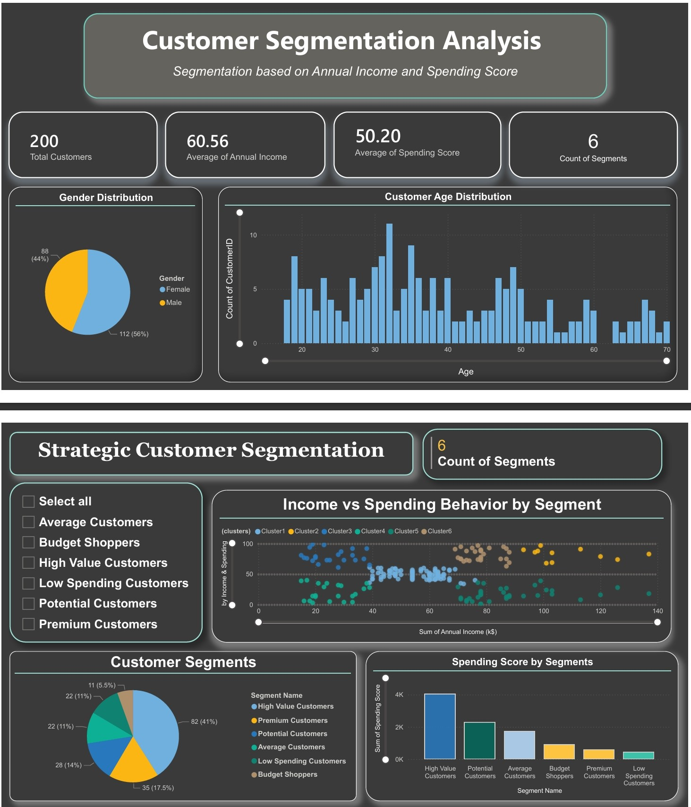

# 📊 Customer Segmentation — Power BI Dashboard

## 📌 Overview

This folder contains an interactive Power BI dashboard that presents customer segmentation insights in a clear and business-focused manner.

The dashboard visualizes customer demographics, income levels, spending behavior, and segment distribution to help stakeholders understand different customer groups and support data-driven decision-making.

---

## 🖼️ Dashboard Preview

---

## 📂 Contents

* `Customer_Segmentation_Dashboard.pbix` — Interactive Power BI report
* `customer_segmentation_dashboard_data.xlsx` — Dataset used for visualization
* `Mall Customer Segmentation Dashboard img.jpeg` — Dashboard preview image

---

## 📖 Dashboard Story

The dashboard provides a complete view of the customer base — from **who the customers are** to **how they behave**.

### 👥 Page 1 — Customer Profile Overview

Focuses on demographic insights and overall metrics:

* Total number of customers
* Average annual income
* Average spending score
* Gender distribution
* Age distribution

➡️ Helps understand the composition of the customer base.

---

### 🎯 Page 2 — Strategic Customer Segmentation

Analyzes customer behavior and value across segments:

* Interactive segment selection panel
* Income vs Spending behavior by segment
* Segment-wise distribution of customers
* Comparison of spending scores across segments

➡️ Helps identify high-value customers and growth opportunities.

---

## 📊 Key Insights

* Most customers belong to mid-income groups with varied spending patterns
* High-value customers form a smaller segment but contribute significantly to revenue potential
* Low-spending customers are more numerous but have lower impact
* Customers with similar income levels may exhibit very different spending behavior
* Demographic factors influence purchasing patterns across segments

---

## 💼 Business Value

This dashboard enables businesses to:

* Identify and prioritize high-value customers
* Target potential customers for growth
* Design personalized marketing strategies
* Improve customer retention
* Optimize resource allocation
* Support strategic decision-making

---

## 🔍 Interactive Features

* Segment-based filters (slicers)
* Dynamic visuals that update instantly
* Comparative analysis across customer groups
* User-friendly layout for exploration

---

## ▶️ How to Use

1. Download the `.pbix` file
2. Open it using Power BI Desktop
3. Refresh the data source if prompted
4. Use filters and visuals to explore insights

---

## 📎 Note

The segments shown in this dashboard are business-oriented categories created to represent customer value and spending behavior.
They translate analytical findings into clear, actionable insights for decision-makers.

